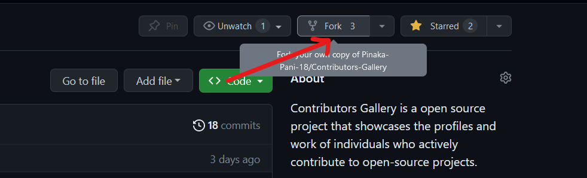

# Contribution Rules📚:

Before you start contributing, we expect all contributors to follow these guidelines to ensure a positive and inclusive community.

- Create an issue about the code or contributions you want to make.
- Go through the issues before creating one,to avoid duplicate issues.
- Once assigned only, make your contributions and create your first PR or else the PR will be closed by the maintainer.
- kindly provide a simple detail about you code or contribution,so others can learn and improve on it.
- Do NOT remove other content.
- Try to keep pull requests small to minimize merge conflicts.

## Getting Started 🤩🤗:

1. Fork this repo (button on top)
   ()

2. Clone on your local machine
   

   ```markdown
   git clone https://github.com/<your-username>/Contributors-Gallery.git
   ```

3. Navigate to project directory.

   ```markdown
   cd Contributors-Gallery
   ```

4. Avoid Conflicts {Syncing your fork}

An easy way to avoid conflicts is to add an 'upstream' for your git repo, as other PR's may be merged while you're working on your branch/fork.

    ```markdown
    git remote add upstream https://github.com/Pinaka-Pani-18/Contributors-Gallery
    ```

You can verify that the new remote has been added by typing

    ```markdown
    git remote -v
    ```

To pull any new changes from your parent repo simply run

    ```markdown
    git merge upstream/master
    ```

- Now make changes in your repo

5. Create a new Branch
   ```markdown
   git checkout -b my-new-branch
   ```
6. Add your changes

   ```markdown
   git add .
   ```

7. Commit your changes.
   `markdown
 git commit -m "Relevant message"
 `
   

8. Then push

   ```markdown
   git push origin my-new-branch
   ```

9. Create a new pull request from your forked repository.

This will give you any eventual conflicts and allow you to easily solve them in your repo. It's a good idea to use it frequently in between your own commits to make sure that your repo is up to date with its parent.
